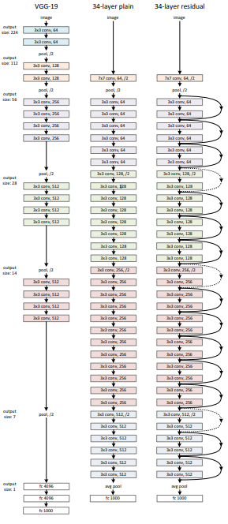
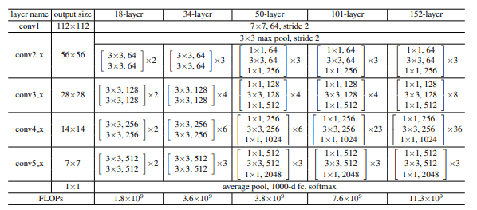
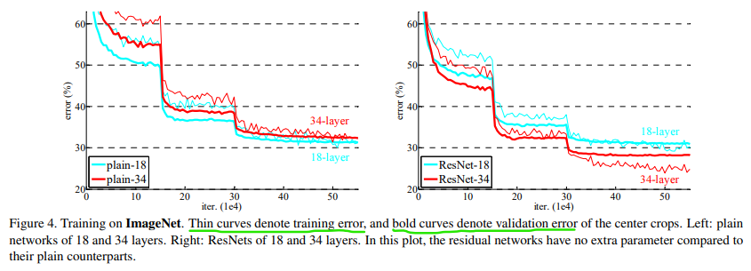
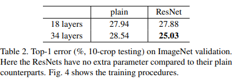
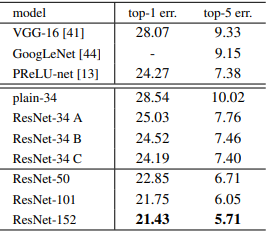
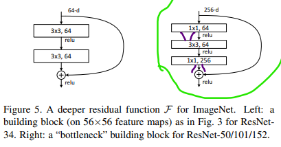
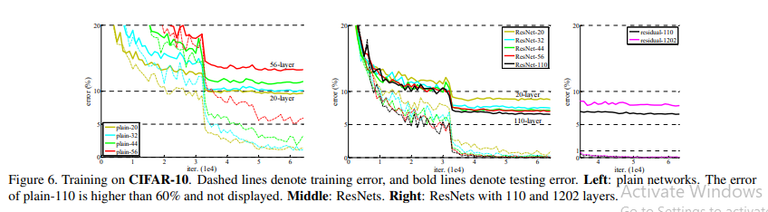

## Results

  Example network architectures for ImageNet. 
  Left: the VGG-19 model (19.6 billion FLOPs)
  Middle: a plain network with 34 parameter layers (3.6 billion FLOPs).
  Right: a residual network with 34 parameter layers (3.6 billionFLOPs). The dotted shortcuts increase dimensions.

This paper focuses on the comparison between plain networks and their ResNet counterparts, having same number of layers but just adding the shortcut links, in all these models shortcut links are just identity mappings, or zero-padding.
We consider Plain vs ResNet Networks with 18, 34, 50, 101, 152 layers, the models are as explained in the picture below.

**Note**: 
* convB_X: *B* is the block number, *X* is the layer number within the block.
* the first layer of some blocks, namely, conv3_1, conv4_1, conv5_1 perform downsampling with stride on 1.

### Results

As shown in the above chart, increasing the number of layer in the plain network causes a degradation in training/validation errors (models with more layers tend to have higher error rates). this degradation is caused not by *vanishing and exploding gradients*.

> We argue that this optimization difficulty is unlikely to be caused by vanishing gradients. These plain networks are trained with BN, which ensures forward propagated signals to have non-zero variances.

The paper also states

> We *conjecture* that the deep plain nets may have *exponentially low convergence rates*, which impact the reducing of the training error. **The reason for such optimization difficulties will be studied in the future**.

So the Actual reason for degradation is not determined in this paper.

On the other hand, ResNet models experience improvement by the addition of more layers, this was acheived by using no additional parameters.

### Important observations
1. Resnet34 model reached 2.8% lower error rate than Plain18, but more importantly, the improvement in Resnet34 performance is not just in training accuracy but also generalizable to the validation accuracy (ass shown in the above figure), while means that *this paper managed to axtually solve the problem of accuracy degradation and obtained accuracy gains from the addition of more layers.*
2. ResNet34 reduces the top-1 error by 3.5% (Table 2), resulting from the successfully reduced training error. This comparison verifies the effectiveness of residual learning on extremely deep systems. ([what are top-1 and top-5 errors?](https://stats.stackexchange.com/questions/156471/imagenet-what-is-top-1-and-top-5-error-rate))

## Identity vs. Projection Shortcuts
There are 3 approaches
1. Parameter-free shortcuts: use zero-padding for increasing dimensions, use identity mapping for the rest.
2. Projection shortcuts are used when changing dimensions, otherwise use identity mapping.
3. All shortcuts are projections.

adding more parameters surely improves the perfromance, so the options above are sorted from least to best, **however** it's worth mentioning that:
1. The parameter free approach is not far from the other two, and it has no additional costs, so it's very acceptable.
2. the second option is has somewhat higher performance than the parameter free model, and only marginally less than last option in performance, so *it can be a good trade of between the other 2 options*.
3. The last approach is the best, but it comes at a high cost of operations, the projection matrices won't be small usually.

## Deeper BottleNeck Architectures

If you have concerns about the training time of the neural network, you can use this *economic version* of Residual block (*BottelNeck design*).

Instead of 2 layers, we have 3 Conv layers, the middle one is 3X3, while the other 2 are 1X1.
The first 1X1 Conv layer is used to reduce the number of channels (sortof compressing the features), then the 3X3 Conv layer operate on the reduced version, then we use the second 1X1 Conv layer to increases (restore) the dimensions again.

In this approach, using projection links would increase the training time (double it according to the paper), because the link will be connecting two high dimensional ends, so in this block we will use the parameter free methods (identity mapping and zero-padding).

**Note:** all Resnet networks above 34 layers mentioned in this paper are using BottleNeck blocks to reduce training time.

## Over 1000 layers

The accuracy of the Resnet1202 is less than that of the Resnet101, But we argue that the model is too large, unnecessarily large, and the cause of the degradation in accuracy is overfitting, which can be address by regularization methods, such as [maxout](https://arxiv.org/pdf/1302.4389.pdf) or dropout ... etc.  
But this is not within the scope of this paper.