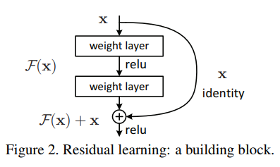

# Summary

## Basics

## Some Variations

### ResNet

* Solves problem of training accuracy degradation in DNNs, hence allowing deeper networks.
* Introduces shortcut (Skip link) that makes sure the addition of more layers at least won't hurt the network perfromance 

$$
H(x) = f(x, W_i) + W_s . x
$$

* According to this equation, the layers learn a residual function $f(x)$, the weights $W_i$ can be driven to zero, if the learnt function is useless.
* $W_s$ is optional, if the input size and output size are the same, and you want identity mapping, you can omit it, however if you want to change the size, you will need it. you can have it $W_s$ be static used to change size only or a tunable parameter as well.
* For more details, Check the [paper](https://arxiv.org/pdf/1512.03385.pdf), or the summary I added [here](./ResNet/Readme.md).

### 1x1 filters
### Inception Network

## Transfer learning

### LeNet-5
### AlexNet
### VGG

### ImageNet

### YOLO