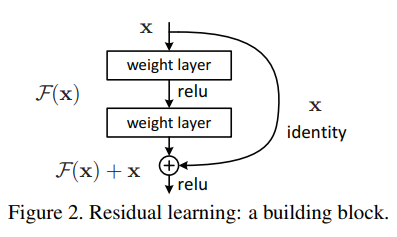

# ResNet: Residual Network
## Intro
This idea was introduced in the paper [**Deep Residual Learning for Image Recognition**](https://arxiv.org/pdf/1512.03385.pdf) By a Team from *Microsoft*, their work can be found on their [Github Repo](https://github.com/KaimingHe/deep-residual-networks) MIT licence, the repo uses Caffe framework, but there are multiple implementations that use Tensorflow as well.

Training Deep neural nets is not as easy as adding more layers, the addition of more layers at some times may make the perfromance worse, this degradation of training accuracy occurs when more layers are added means that deeper layers are harder to train, and can be due to multiple factors.

### Vanishing and Exploding gradients
A famous problem in the training of Neural networks, that make gradients decrease to near 0 values, or explode to very large values making the training stop.
But this problem can be addressed by normalization (initial and between layers).

(*add references*)

### The Optimizer just can not train this much parameters
As stated in the [paper](https://arxiv.org/pdf/1512.03385.pdf)
> When deeper networks are able to start converging, adegradation problem has been exposed: with the network depth increasing, accuracy gets saturated (which might be unsurprising) and then degrades rapidly. Unexpectedly, such degradation is not caused by overfitting, and adding more layers to a suitably deep model leads to higher training error

When a neural network has few parameters, the optimizer would have hard time training the neural net, because it can not fit the target function $H(x)$, so we increase the number of parameters (more neurons per layer or more layers), and hoefully the optimizer would now have more flexibility to fit the target function. as the number of parameters increase further, the model becomes more flexible and fits not only the target function but the error function in the data as well, and so we get *overfitting*, when number of layers is added further, it is experimentally found that the accuracy starts to drop.

### OR i also like to think of it this way
Have you ever seen a video like [this](https://youtu.be/UdWWIh7DPMQ), or [that](https://youtu.be/QHAh5q10mEI), it is a simple game that demonstrates the degradation of data as it passes from one person to another.
This is quite similar to our neural network, except each layer *does not intend* just pass the data as it recieved, but pass what it learnt from it (in the video students pass the message they remember). But what if what they learnt is wrong (what if the student did not remember the message correctly), the next layer will be learning from wrong data, step by step, the wrong part of the data flowing through the network will outgrow the correct part until the output becomes almost indepentent from the input, only driven by the random wights we created.
This should be how the first iteration goes for all neural nets, but the problem should become even worse for larger(deeper) neural nets.
Surely the optimizer will keep altering the weights to get better results, but *i guess* this will take exponentially longer time, if even possible. the number of parameters is too large, the optimizer changes them all in every back-propagation round, may be changing some of them.

Imagine the case with communication game again, what if the student not only recieve the data from the previous student, but also the one before him, would not that increase the accuracy?.

## The proposed solution
Imagine we have two models, a deep one and shallow one, the deep model is just the shallow model with some added layers (equivalent to identity), if this is the case then the two models are essentially the same (the will give same result), so the training error of the deep model should be no higher than its shallower counterpart.

But if we actually construct a deep model like previous one except the added layers are free to learn (not identity), the model accuracy only drops. the added layers can not even learn identity function or do any better than that.

What if we add a shortcut pass parallel to the added layers, and formulate the output from the shortcut pass (essentially the output of the shallow network), and the output of the added layers.
This way it is guaranteed that the output will be at least as good as the output of the shallow network.

### More details

  

Assume the target function we need to learn is $H(x)$, we let the stacked non-linear layer learn the mapping $f(x) = H(x) - x$, now the orignal mapping is recast as $H(x) = f(x) + x$.

the shortcut link provides $x$ as the original answer, while the learnt *resedual function*  $f(x)$ sort of completes the picture if necessary.

Now the optimizer gets to choose between the identity mapping or the learnt residual function, if identity mapping is better the weights of the non-linear layers are driven to zero, if the learnt function is of value it is added to the input and passed as output ( or to next layer).

This makes the output of deeper layers more controlled by previous layers and does not stray away, after all the learnt functions of each layer are all just residual functions only added as needed.

**Note**: in order to added $f(x)$ and $x$, they must have the same size, so the input and output of a ResNet must have the same size.

#### What if we need different output size
Usually, the input size and output size are different, to have that with *ResNet*, we add some weights in the shortcut, so the the equation can be as follows

$$H(x) = f(x) + W_s . x$$

$W_s$ can be like identity matrix that simply changes the size, so it adds no additional parameters, or it can be some learnable weights (making the the shortcut a one dense layer).

## What is ResNet good for
* It solves the problem of *training accuracy degradation*, by adding the shortcut connection, Which makes sure adding more layers will at least cause no problem, if not add improvement, **So it allows training much Deeper networks**.
* The skipped layers are not necessarily 1 layer, or just Dense, it can be multiple layers of any types, so the model is generic.
* Using shortcuts without any weights, the ResNets, do not need any more parameters than its plain counterpart, but still preforms better.
* (I think) It makes training Deep networks easier, so with ResNets, you can reach convergence faster.

## it's worth noting
* You can use a conv net with stride of 2 (half filter size) to make something like Max pooling, that's used in the model proposed in this paper.