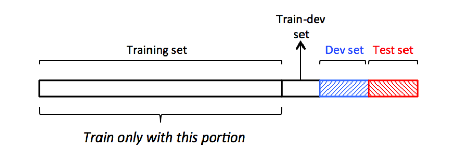
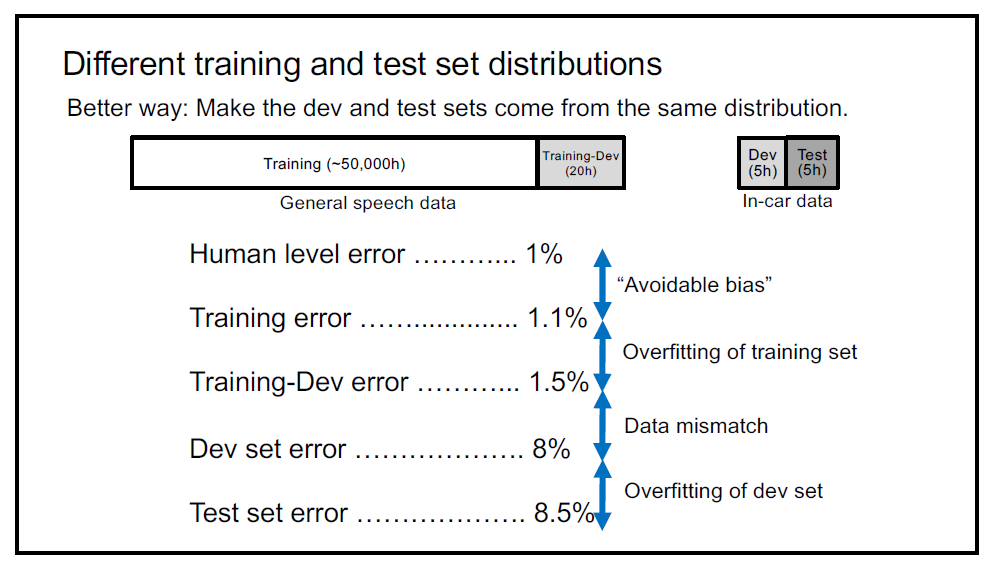

# Bias and Variance

- Very good understanding of Bias and Variance is a common characteristic of skilled machine learning practitioners
- Even when you think you have understood all basic concepts of bias and variance there seems to be always more to it.
- In machine learning we mostly the discussion of bias variance trade-off, but specially with machine learning there is less of a trade-off between Bias and Variance, we can reduce both bias and variance almost independently. 

content:

1. How to divide your dataset.
2. What is Bias problem.
3. What is Variance problem.  
4. Solutions

## How to divide your data set

  

### Training set

- the model is trained on this data directly
- it's always the largest portion of the dataset

### Testing set

- the system actual evaluation metric is its performance on the *testing set*
- it's always smaller than the training set but at least as large as the validation set.
- This data is very important, you don't use this set very often, you only use it after
the design of your model and training is over and you now have something that you feel confident
about its performance, you use this set to test if your confidence has basis or not.  
- you may not have a testing set and it okay, in this case you will be only using validation set
to test your performance but it's not recommended, to avoid the possibility of overfitting the validation set

### Validation set

- Similar to the Testing set, this set was used to measure the performance of the Model.
- Also the Model is not trained on the validation set, but it's still accessible for developers to
evaluate the Model performance during *Development* in contract with Testing set which is used to 
measure the Model performance *Before Deployment*.
- Some developers may use it to gain insights from the data about what their Model is not predicting well,
in order to manually intervene *somehow*.

### Train-dev set

- it's a **SUBSET** of the training set, so it comes from the same distribution of the training set.
- it's used to Determine the source of the problem, is it *variance problem* or *Mismatch problem*?,
as will be explained in the following section

### How to divide the Dataset

- A small dataset (10~30k samples more or less) has a certain requirement.  
In order for the testing and validation to work we need the to have a sufficiently large number of
samples, so their distribution can be representative of the actual distribution.  
so we follow the conventional way to divide the data set like (TR:60, V:20, TS, 20), or (TR: 80, TS: 20) 
without validation, generally we keep large portion of the dataset for testing and validation.

- For large dataset (1~10M samples or more), you don't need to keep the previous division, we
only need few thousand samples or even less for Testing and Validation set to get a set that is
large enough to represent the actual distribution, and the rest will go to the Training set so
it's more natural to find a division like (TR:98,V:1,TS:1), or going even further (TR:99,V:0.5,TS:0.5)
, for the era of big data this is fairly reasonable.

- the *train-dev dataset* is a subset of the training set and is usually at most the size of the validation set 
for large datasets, or even much less to non-existent for small datasets, it's commonly used when using data from 
different distributions.

<!-- ### further notes -->

### Distribution

There are 2 things that act as a target through the process of model development  

1. The validation set
2. the performance metrics (cost function and other evaluation metrics)  

the team can use those two to evaluate how well they are doing, so setting them correctly is of utmost importance.

The validation set might seem trivial, but it has a lot of uses to insure the results obtained are real. there are some conditions on how the validation set should be picked:

1. the validation set **must** be from the same distribution as the training set.
2. both, training and validation sets, have to be of the same distribution the model is expected to work on after deployment.

if a mismatch occurs then it's like training a blind person on archery to hit a target in a specific location, with some hardship it might work, but you come at the competition and change the target location it should be surprising for him to miss, he still aiming at the target in his imagination, the training process of a  model is like teaching our blind model to form the image of a target in his metaphoric head, the model keeps imagining where it's, and what it looks like, and step by step, epoch by epoch, the blurry image of the target starts to become clear, and the model can imagine it better, and throw the arrow towards it, if the validation set is not close enough to the training set, it means our training was meaningless, the model won't be able to reach the target that it wasn't trained for, it might be close sometimes if you are lucky but mostly not close enough, or even not remotly close, So the what to take out from this paragraph is to **always make sure the different sets you work on come from the same (or at least similar) distribution(s)**.

### What is the issue?

## What is Bias problem

<!-- TODO explain what is Bias and its problem -->

## What is Variance problem

<!-- TODO explain what is Variance and its problem -->

## Solutions

### Bias

<!-- TODO explain how the solutions actually solve the problem -->

This is what we start solving first, we need to aim at raising the training set error and there are
multiple methods we can use:  

1. Use bigger network
2. Train longer
3. a Different Neural network architecture may help like (CNN, RNN, ResNet, Inception-Net, ...)

### Variance problem - Over-fitting

<!-- TODO explain how the solutions actually solve the problem -->

Once we have taken care of the Bias problem we should consider the variance.

1. Regularization
2. More data always helps
3. Early stopping
4. Different network architecture
